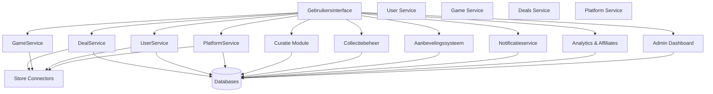
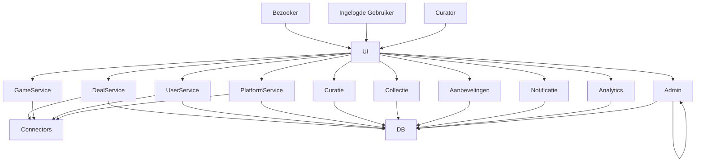

# Architectural Decision Record's

# ADR-0001: Microservices Architectuur

## Status: Accepted

## Context

Ons systeem heeft veel verschillende onderdelen (zoals deals, platformen, users...) die elk apart kunnen evolueren. Omdat we willen dat het systeem schaalbaar, betrouwbaar en makkelijk onderhoudbaar is, is het handig om deze onderdelen los van elkaar te bouwen.

## Beslissing

We kiezen voor een microservices architectuur. Elk onderdeel van het systeem wordt een aparte service.

## Consequenties

- Elke service kan apart ontwikkeld, getest en geschaald worden.
- Fouten in één service brengen minder snel het hele systeem in gevaar.
- We moeten goed nadenken over communicatie tussen services (API’s, foutafhandeling...).

---

# ADR-0002: Kubernetes voor Orchestratie

## Status: Accepted

## Context

We willen onze microservices automatisch kunnen beheren: opstarten, schalen, opnieuw opstarten bij fouten en makkelijk configureren.

## Beslissing

We gebruiken Kubernetes als orchestratieplatform.

## Consequenties

- Kubernetes zorgt voor hoge beschikbaarheid en automatische updates.
- We kunnen declaratieve configuraties gebruiken via YAML-bestanden.
- De infrastructuur wordt technischer en vereist meer kennis om goed te beheren.
- Kubernetes werkt goed samen met CI/CD pipelines.

---

# ADR-0003: CI/CD Pipelines (Continuous Integration/Deployment)

## Status: Accepted

## Context

We willen dat nieuwe versies van onze software automatisch gebouwd en gepubliceerd worden.

## Beslissing

We bouwen een CI/CD pipeline met GitHub Actions. Het bestand `deploy.yml` heeft de inhoud van hoe we CI/CD deployen naar Docker Hub. Bij elke push naar **main** worden de applicaties gebouwd en geüpload naar Docker Hub.
We zijn van plan om later ook automatisch te deployen naar Kubernetes, maar dat lukt nu niet met een lokaal cluster. (`kubernetes.docker.internal`)

Een oplossing hiervoor is het gebruik van een **extern Kubernetes-cluster**, zoals Google Kubernetes Engine (GKE). Deze cluster vereist een betalende setup, daarom hebben we besloten om **de CI/CD pipeline op te zetten tot en met Docker Hub**, en de Kubernetes-deploy stap te behouden als documentatie. Zodra we een extern Kubernetes-cluster hebben, voegen we een `kubectl apply` stap toe voor automatische deployments.

## Consequenties

- De pipeline voert automatisch builds en Docker-pushes uit bij elke push naar `main`.
- De Kubernetes-deploy stap is voorbereid, maar wordt (nog) niet uitgevoerd in CI/CD.
- Indien later een extern cluster beschikbaar wordt, kan de pipeline eenvoudig worden uitgebreid.

---

# ADR-0004: Start met Monolithische Architectuur

## Status: Accepted

## Context

Een monolithische applicatie is eenvoudiger te bouwen en debuggen in de beginfase. Daarom beginnen we in onze analyse met het ontwerp van één applicatie waarin alle onderdelen samen draaien.

## Beslissing

Voor de initiële analyse werken we in een monolithisch denkmodel, terwijl de implementatie microservices volgt.

## Consequenties

- De logica is initieel eenvoudiger te ontwerpen als één geheel.
- Voor de implementatie schakelen we snel over naar microservices voor betere schaalbaarheid.

---

# ADR-0005: Relationele Database

## Status: Accepted

## Context

We beheren veel gestructureerde data: gebruikers, games, deals...

## Beslissing

We kiezen voor MySQL als relationele database.

## Consequenties

- We hebben goede ondersteuning voor relaties tussen data (bijv. gebruiker → platform → game).

---

# Architectuuroverzicht

## Fase 1: Monolithische Architectuur

We beginnen met een **laag-voor-laag (layered) monolithische architectuur**, die bestaat uit:

- **Presentatielaag**: webinterface en mobiele clients.
- **Business Logic Layer**: bevat regels voor collecties, aanbevelingen, prijslogica...
- **Integration Layer**: communicatie met externe APIs (Steam, Epic...), authenticatie...
- **Persistence Layer**: toegang tot relationele databases (MySQL) met games, deals, users...

### Waarom?

- Snelle opstart en eerste versie bouwen.
- Minder infrastructuur nodig in het begin.
- Eenvoudiger te testen en fouten op te lossen.

Deze structuur maakt het later makkelijker om over te stappen naar microservices, omdat de onderdelen nu al logisch gescheiden zijn.

---

## Van Logische naar Fysieke Architectuur

### Monolithisch Model (Layered Architecture)


### Mapping Uitleg

In het begin zitten alle onderdelen (UI, logica en data) samen in één Node.js-applicatie. Alles draait in één codebase, op één server of container. Alleen de database is apart.

In de microservices-versie splitsen we elk onderdeel op in een aparte service (bijv. gebruikers, games, deals...). Elk draait in zijn eigen ‘Pod’ in Kubernetes. Een Pod is een soort ‘doos’ waarin een applicatie draait binnen Kubernetes.

## Microservices Architectuur

Onderstaande tekening toont de microservices-architectuur. Deze bestaat uit een API Gateway, aparte backendservices en koppelingen met externe diensten (zoals game stores).


## Voor- en Nadelen van Microservices

### Voordelen

- Makkelijk schaalbaar: We kunnen delen van de applicatie apart groter maken als dat nodig is, zonder de hele app aan te passen.
- Teams kunnen los van elkaar werken: Elk team kan aan zijn eigen onderdeel werken en het ook apart online zetten.
- Vrijheid in technologie: Elk onderdeel mag zijn eigen programmeertaal of database gebruiken als dat beter past.

### Nadelen

- Meer onderdelen: We hebben veel losse stukjes software die goed met elkaar moeten samenwerken, dat is moeilijker dan één geheel.
- Fouten opsporen is lastiger: Als er iets misgaat, is het moeilijker om te vinden waar precies.

## Fysieke Architectuur (Microservices)

In dit model draait elke service in een aparte Docker-container binnen een Kubernetes-cluster.

Elke microservice wordt apart gedeployed (uitgerold) met een eigen configuratie en communicatiekanaal. We gebruiken een Ingress Controller om verkeer van buitenaf (bijv. chippygames.com) naar de juiste service te sturen.

De database draait ook als een aparte container (Pod) in het cluster.

De CI/CD pipeline met GitHub Actions zorgt ervoor dat bij elke wijziging automatisch een nieuwe versie wordt gebouwd, geüpload naar Docker Hub, en (later configureren) gedeployed naar Kubernetes.

## Waarom dit werkt

- Elke service kan apart worden aangepast of herstart zonder dat het hele systeem stopt.
- Kubernetes controleert automatisch of alles nog werkt (met health checks).
- Het systeem is beter bestand tegen fouten en groeit makkelijk mee.

## Monitoring, Authenticatie en Resilience

De microservicesarchitectuur ondersteunt:

- **Monitoring** via `/health` endpoints en Prometheus. In deze demo is dit geïmplementeerd op de Game Service. Zie `monitoring.md` voor details.
- **Authenticatie** via een aparte `auth-service` met JWT-tokens. Routes kunnen beveiligd worden met middleware. Meer uitleg staat in `authentication.md`.

- **Resilience** dankzij Kubernetes (herstart bij falen), retries (bij tijdelijke netwerkfouten) en fallback-mechanismen (zoals een lege lijst als een externe service faalt). Details in `resilience.md`.

---

# Deze sectie maakt deel uit van de technische implementatie

# Authenticatie Overzicht

## Werking van het authenticatieproces

- Een gebruiker logt in met e-mail en wachtwoord via de `user-service`.
- Bij succesvolle login ontvangt de gebruiker een **JWT-token** (JSON Web Token), dat fungeert als digitale toegangssleutel.
- De client stuurt dit token bij elke API-aanvraag mee in de `Authorization` header:  
  `Authorization: Bearer <token>`.
- Andere services controleren dit token met middleware (`authenticateToken`).

## Rollen in het systeem

- **Gebruiker**: kan zoeken, collecties maken, deals bekijken.
- **Curator**: kan extra content beheren, zoals media of aanbevelingen.
- **Admin**: heeft toegang tot beheerfuncties en gebruikersbeheer.

## Beveiligingsmaatregelen

- Tokens verlopen na 1 uur (`expiresIn: "1h"`).
- Wachtwoorden worden veilig opgeslagen met `bcrypt` hashing.
- Refresh tokens kunnen in een echte productieomgeving opgeslagen worden in **HTTP-only cookies**. (nu nog niet geïmplementeerd)
- De `SECRET_KEY` voor JWT moet in productie worden opgeslagen in een `.env` bestand of secrets-manager.

## Middleware Implementatie

Elke service (zoals Game, Deal en Platform Service) heeft een eigen `auth.js` middleware:

```js
const jwt = require("jsonwebtoken");

function authenticateToken(req, res, next) {
  const authHeader = req.headers["authorization"];
  const token = authHeader?.split(" ")[1];

  if (!token) return res.status(401).json({ error: "Geen token meegegeven" });

  jwt.verify(token, "SECRET_KEY", (err, user) => {
    if (err) return res.status(403).json({ error: "Ongeldige token" });
    req.user = user;
    next();
  });
}

module.exports = authenticateToken;
```

---

# Karakteristieken van het Systeem

## Algemene Eigenschappen

### 1. Snelheid (Performance)

Omdat prijzen en kortingen vaak veranderen en we gegevens ophalen van externe winkels, moet het systeem snel kunnen reageren.

### 2. Beschikbaarheid (Availability)

Gebruikers verwachten dat het systeem altijd werkt. Als een winkel tijdelijk offline is (bijv. Steam of Amazon), moet ons systeem blijven draaien en eventueel tijdelijke oplossingen gebruiken.

### 3. Schaalbaarheid (Scalability)

Wanneer het aantal gebruikers, winkels of games groeit, moet het systeem mee kunnen groeien zonder traag of instabiel te worden.

### 4. Onderhoudbaarheid (Maintainability)

Elke service moet apart aangepast kunnen worden zonder dat andere onderdelen kapot gaan. Dit maakt het eenvoudiger om fouten op te lossen of nieuwe functies toe te voegen.

### 5. Beveiliging (Security)

Gebruikersgegevens zoals wachtwoorden, collecties en voorkeuren moeten veilig worden opgeslagen en verstuurd.

---

# Driving Characteristics (belangrijkste 3)

## 1. **Live bijwerken van gegevens**

## Categorie: Performance

→ Kortingen kunnen snel veranderen. Daarom moet ons systeem bijna live updates kunnen doen, met hulp van snelle opslag (caching) van eerder opgehaalde data en optimalisaties.

## 2. **Blijft werken bij externe storingen**

## Categorie: Resilience (valt onder Availability en Reliability)

→ Als een externe winkel offline is, mag onze app niet stoppen. We gebruiken technieken zoals:

- Retries (opnieuw proberen)
- Fallbacks (tijdelijke vervanging)
- Circuit breakers (automatisch stoppen bij herhaalde fouten)

## 3. **Personalisatie & Aanbevelingen**

## Categorie: User Experience / Intelligence / Performance

→ Gebruikers moeten relevante deals en games zien op basis van hun voorkeuren. Daarvoor gebruiken we gebruikersdata en slimme algoritmes.

---

# Context Diagram

Dit is een overzicht van de interactie tussen ons platform en de externe gebruikers of systemen.

## Externe Gebruikers

- **Bezoeker**: kan door games bladeren en kortingen zien, maar is niet ingelogd.
- **Ingelogde gebruiker**: kan collecties maken, games volgen en gepersonaliseerde aanbiedingen bekijken.
- **Curator**: kan content beheren, zoals aanbevelingen of media.
- **Admin**: beheert gebruikers en systeeminstellingen.

## Externe Systemen

- **Winkels zoals Steam, Amazon en Epic Games**: leveren gameprijzen, details en promoties via hun API’s.

## Ons Platform

- **ChippyGames-platform**: het centrale systeem dat alle data verzamelt, verwerkt en toont aan gebruikers.

## Interfaces

- **REST API**: zorgt voor communicatie tussen frontend en backend.
- **Webinterface**: de website die gebruikers zien en gebruiken.

---

# Deployment Overzicht

Ons platform draait in een Kubernetes-cluster. De verschillende onderdelen van het systeem zijn opgedeeld in aparte services en worden automatisch beheerd en geschaald.

## Onderdelen

- **API Gateway**
  We gebruiken een Nginx Ingress Controller om inkomend verkeer van gebruikers naar de juiste service te sturen.

- **Services**:
  Elke service draait als een aparte “deployment” in Kubernetes:

  - `user-service`: beheert gebruikers en authenticatie.
  - `game-service`: houdt info bij over games.
  - `deal-service`: verwerkt aanbiedingen en prijzen.
  - `platform-service`: regelt platforms en winkelintegraties.

- **Database**:
  Alle services gebruiken een gezamenlijke database-‘deployment’, genaamd `db-deployment`. Hierin zitten meerdere MySQL-databases (zoals `users-db`, `deals-db`, `platforms-db`).

## Visueel Overzicht


## Uitleg

- Elke service draait als een eigen Deployment met 2 replicas.
- Alle services praten met dezelfde database-deployment, die meerdere logische databases bevat.
- De Ingress Controller stuurt al het verkeer naar de juiste service, afhankelijk van de URL.

---

# Logische componenten

We combineren twee manieren om het systeem te begrijpen:

- Actor/actie: wie doet wat?
- Workflow: hoe verlopen de stappen achter de schermen?

## Actoren:

- Bezoeker (Niet ingelogd)
- Gebruiker: ingelogd, met een persoonlijke collectie
- Curator: keurt content goed, voorkomt dubbele of slechte games
- Winkel-API's: zoals Steam, Amazon, PlayStation Store…
- Admin: beheert het platform

## Componenten:

- User Service: regelt login, registratie, profiel en authenticatie
- Game Service: beheert games, beschrijvingen, afbeeldingen en ratings
- Deals Service: verzamelt prijzen uit winkels
- Platform Service: beheert platforms (PC, PS5, Switch...)
- Store Connectors: haalt automatisch data op uit winkels via API's of scraping
- Curatie Module: laat curators content goedkeuren of samenvoegen
- Collectiebeheer: gebruikers beheren hun eigen games
- Aanbevelingssysteem: stelt nieuwe games voor op basis van jouw collectie en ratings
- Notificatieservice: laat de gebruiker weten wanneer een game een promotie heeft
- Analytics & Affiliates: houdt inkomsten en kosten bij, toont hoeveel er is opgehaald
- Admin Dashboard: beheert het systeem

## Workflow (voorbeeld):

1. Inloggen
   -> De gebruiker logt in, gebruikers voorkeuren worden geladen

2. Games bekijken
   -> De gebruiker bezoekt een gamepagina
   -> De app toont info uit de catalogus én de beste deals van het moment

3. Game toevoegen aan collectie
   -> De game wordt toegevoegd
   -> Het aanbevelingssysteem wordt bijgewerkt

4. Prijs volgen
   -> De notificatieservice houdt de prijs in de gaten
   -> De gebruiker ontvangt een melding als de prijs onder zijn/haar drempel komt

5. Games uploaden
   -> De gebruiker voegt zelf een game toe
   -> De curator keurt ze goed

## Diagram



## Diagram met Actoren



# Deze sectie maakt deel uit van de technische implementatie

# Monitoring Overzicht

## Gebruikte tools:

- **Prometheus**: Verzamelt runtime-metrics van de game-service
- **Grafana**: Visualiseert de metrics in dashboards
- **Alertmanager**: Stuurt waarschuwingen bij problemen

## Wat we monitoren (momenteel enkel voor de Game Service):

- Beschikbaarheid van de Game Service via `/health` endpoint  
  (wordt ook gebruikt door observability/Kubernetes)
- Basis-metrics via Prometheus, zoals:
  - Uptime van de Game Service
  - Eventuele errors in de Game Service
- Integriteit van externe API’s:
  - Fallback logging bij falende externe services (zoals Deal Service)

## Opmerking

Hoewel Prometheus en Grafana optioneel zijn tijdens ontwikkeling, zijn ze cruciaal in productie. Ze zorgen voor inzicht in prestaties, foutopsporing en automatische waarschuwingen.
Voor deze demo zijn metrics enkel geïmplementeerd op de Game Service. In een productieomgeving zouden wij dit uitbreiden naar alle services — bijvoorbeeld via een Prometheus sidecar of door dezelfde code in elk servicebestand op te nemen.

---

# Deze sectie maakt deel uit van de technische implementatie

# Observability in mijn microservices

Ik zorg ervoor dat elke service makkelijk te controleren is, met logging en healthchecks.

## 1. Logging (via `console.log`, `console.error`, en `console.warn`)

- **`console.log()`**
  -> Voor gewone info zoals "Service running on port 3000"

- **`console.error()`**
  -> Voor fouten, zoals als iets misgaat met de database of externe API's:

  ```js
  console.error("Error fetching games with deals:", error);
  ```

- **`console.warn()`**
  -> Voor waarschuwingen die geen crash veroorzaken, zoals wanneer er geen deals zijn gevonden:

  ```js
  console.warn(`Geen deals gevonden voor game ${gameId}`);
  ```

## 2. Healthcheck via /health endpoint

Elke service heeft een eenvoudige endpoint om te zien of die nog werkt:

```js
app.get("/health", (req, res) => {
  res.status(200).json({ status: "ok" });
});
```

- Deze endpoint wordt gebruikt door monitoringtools of Kubernetes om te checken of de service nog "gezond" is.

## Optioneel

- Morgan gebruiken om automatisch alle HTTP-aanvragen te loggen.
- Toevoegen van Metrics en tracing voor nog meer inzicht. (Voor bottlenecks...)
- Elastic Stack gebruiken om logingegevens te analyseren

---

# Deze sectie maakt deel uit van de technische implementatie

# Resilience Mechanismen

Ons systeem moet blijven werken, ook als externe winkels (zoals Steam of Amazon) tijdelijk offline zijn. Daarom gebruiken we deze technieken:

## Retries

Als een verzoek tijdelijk mislukt (bijv. door een netwerkfout), probeert het systeem het automatisch nog een paar keer opnieuw.

Voorbeeldconfiguratie in Game Service:

```js
axiosRetry(axios, {
  retries: 3,
  retryDelay: axiosRetry.exponentialDelay,
  retryCondition: (error) => {
    return axiosRetry.isNetworkError(error) || error.response?.status >= 500;
  },
});
```

## Fallback

Als een externe API zoals de Deal Service niet reageert, gebruiken we een fallback response (zoals een lege lijst). Dit voorkomt dat de hele applicatie crasht:

```js
return []; // fallback als deals niet opgehaald kunnen worden
```

---

# Lessons Learned

Tijdens dit project zijn inzichten opgedaan over CI/CD, microservices en Kubernetes deployments. Deze ervaring vormt de basis voor verdere optimalisatie van het systeem.

# Roadmap (Toekomstige Verbeteringen)

- CI/CD uitbreiden naar een extern Kubernetes-cluster (GKE)
- Toevoegen van gebruikersfeatures zoals ratingsknop en notificaties
- Inloggen/Registreren
- Integraties uitbreiden met externe API's zoals Steam, G2A
