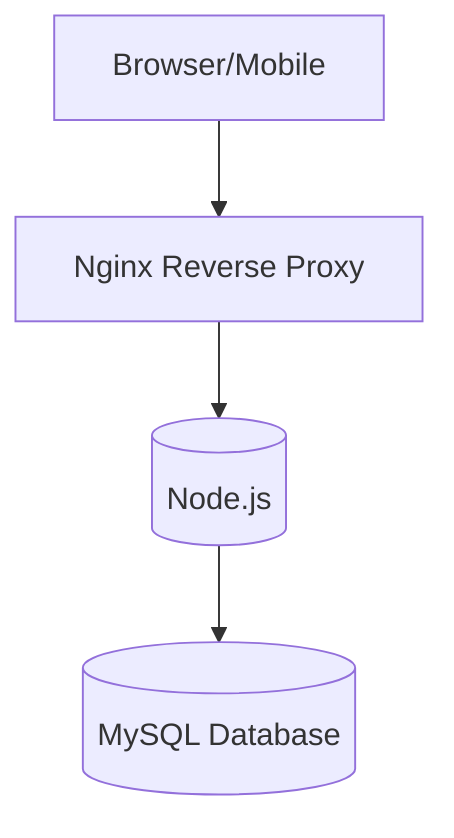
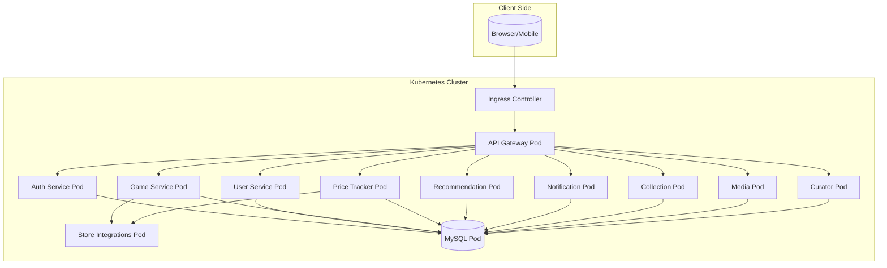

# Architectuuroverzicht

## Fase 1: Monolithische Architectuur

We starten met een **Layered Monolithic Architecture**, bestaande uit:

- **Presentation Layer**: UI en routing
- **Application Layer**: Business logica
- **Data Layer**: Repositories en database access

### Reden

- Snelle prototyping
- Minder infrastructuuroverhead in de beginfase
- Eenvoudig te debuggen en te deployen

Deze stijl maakt migratie naar microservices later eenvoudiger omdat de modules nu al logisch gescheiden zijn.

---

## Mapping van Logische naar Fysieke Architectuur

### Monolithisch

### Mapping Uitleg

In het monolithische model worden alle lagen binnen één Node.js-applicatie beheerd. De presentatie, logica en data-access zitten in één codebase, die draait op een enkele server (of container). De database is een afzonderlijke component, maar rechtstreeks gekoppeld.

In het microservicesmodel zijn de logische componenten uitgesplitst per concern: authenticatie, gebruikers, games, prijzen, etc. Elke service heeft zijn eigen verantwoordelijkheid. De fysieke mapping gebeurt door Kubernetes Pods en Deployments, die elk overeenkomen met één logische component.

## Microservices Architectuur

Onderstaande weergave toont de microservices-architectuur inclusief de API Gateway, backendservices en externe integraties.

## Fysieke Architectuur (Microservices)

In de fysieke architectuur van de microservices draaien alle services in aparte Docker-containers binnen een Kubernetes-cluster. Elke microservice is gedeployed als een eigen Deployment in Kubernetes, met bijhorende Service, en indien nodig ConfigMaps of Secrets.

Alle communicatie van buitenaf verloopt via een Ingress Controller, bijvoorbeeld ingress-nginx. Deze maakt het mogelijk om de applicatie te benaderen via een domein zoals chippygames.com.

Elke service draait in zijn eigen Pod, wat zorgt voor isolation en resilience.

Er wordt een gedeelde MySQL-database gebruikt, die eveneens als een Pod draait binnen de cluster.

GitHub Actions verzorgt de CI/CD: bij elke push naar main wordt automatisch een Docker-image gebouwd, gepusht naar DockerHub en uitgerold naar de Kubernetes-cluster met kubectl apply.

Deze aanpak laat een hoge mate van schaalbaarheid en fouttolerantie toe. Door gebruik te maken van health checks en resource limits in de Kubernetes-configuraties worden problemen vroeg opgevangen.

## Monitoring, Authenticatie en Resilience

Monitoring gebeurt met endpoints zoals /health en readiness/liveness probes die in Kubernetes gedefinieerd zijn.

Authenticatie is voorzien via een aparte auth-service met token-based access (JWT of vergelijkbaar).

Resilience wordt bereikt door gebruik te maken van Kubernetes’ self-healing (restart on failure) en door fallback-mechanismen (bijvoorbeeld bij het falen van externe API-integraties).
