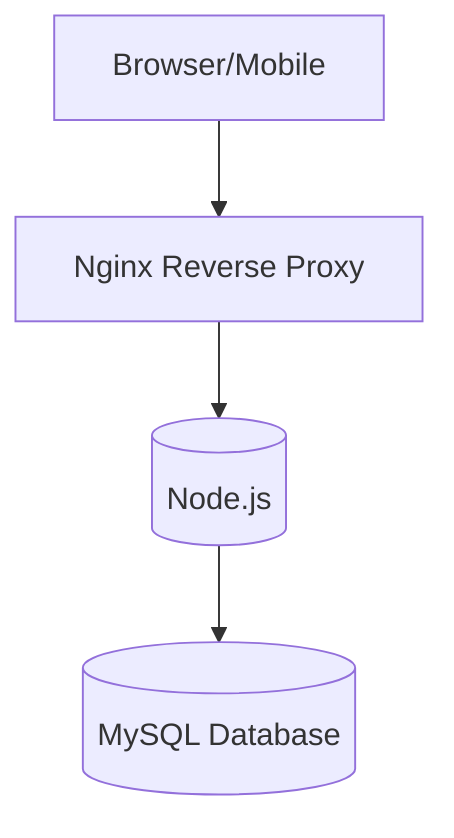
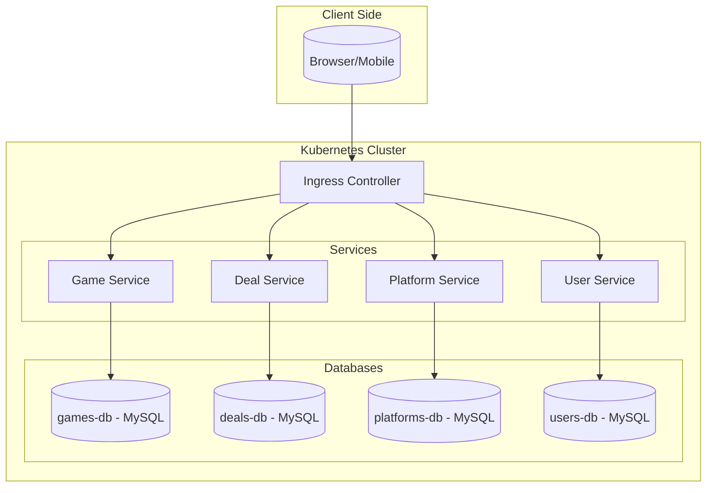

# Architectuuroverzicht

## Fase 1: Monolithische Architectuur

We beginnen met een **laag-voor-laag (layered) monolithische architectuur**, die bestaat uit:

- **Presentatielaag**: webinterface en mobiele clients.
- **Business Logic Layer**: bevat regels voor collecties, aanbevelingen, prijslogica...
- **Integration Layer**: communicatie met externe APIs (Steam, Epic...), authenticatie...
- **Persistence Layer**: toegang tot relationele databases (MySQL) met games, deals, users...

### Waarom?

- Snelle opstart en eerste versie bouwen.
- Minder infrastructuur nodig in het begin.
- Eenvoudiger te testen en fouten op te lossen.

Deze structuur maakt het later makkelijker om over te stappen naar microservices, omdat de onderdelen nu al logisch gescheiden zijn.

---

## Van Logische naar Fysieke Architectuur

### Monolithisch Model (Layered Architecture)

### Mapping Uitleg

In het begin zitten alle onderdelen (UI, logica en data) samen in één Node.js-applicatie. Alles draait in één codebase, op één server of container. Alleen de database is apart.

In de microservices-versie splitsen we elk onderdeel op in een aparte service (bijv. gebruikers, games, deals...). Elk draait in zijn eigen ‘Pod’ in Kubernetes. Een Pod is een soort ‘doos’ waarin een applicatie draait binnen Kubernetes.

## Microservices Architectuur

Onderstaande tekening toont de microservices-architectuur. Deze bestaat uit een API Gateway, aparte backendservices en koppelingen met externe diensten (zoals game stores).

## Fysieke Architectuur (Microservices)

In dit model draait elke service in een aparte Docker-container binnen een Kubernetes-cluster.

Elke microservice wordt apart gedeployed (uitgerold) met een eigen configuratie en communicatiekanaal. We gebruiken een Ingress Controller om verkeer van buitenaf (bijv. chippygames.com) naar de juiste service te sturen.

De database draait ook als een aparte container (Pod) in het cluster.

De CI/CD pipeline met GitHub Actions zorgt ervoor dat bij elke wijziging automatisch een nieuwe versie wordt gebouwd, geüpload naar Docker Hub, en (later configureren) gedeployed naar Kubernetes.

## Waarom dit werkt

- Elke service kan apart worden aangepast of herstart zonder dat het hele systeem stopt.
- Kubernetes controleert automatisch of alles nog werkt (met health checks).
- Het systeem is beter bestand tegen fouten en groeit makkelijk mee.

## Monitoring, Authenticatie en Resilience

Monitoring gebeurt via endpoints zoals /health, die worden gecontroleerd door Kubernetes.

Authenticatie wordt geregeld met een aparte auth-service en tokens (zoals JWT).

Resilience wordt bereikt door gebruik te maken van Kubernetes’ self-healing (restart on failure) en door fallback-mechanismen (bijvoorbeeld bij het falen van externe API-integraties).
