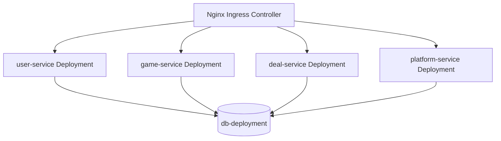

# Deployment Overzicht

Ons platform draait in een Kubernetes-cluster. De verschillende onderdelen van het systeem zijn opgedeeld in aparte services en worden automatisch beheerd en geschaald.

## Onderdelen

- **API Gateway**
  We gebruiken een Nginx Ingress Controller om inkomend verkeer van gebruikers naar de juiste service te sturen.

- **Services**:
  Elke service draait als een aparte “deployment” in Kubernetes:

  - `user-service`: beheert gebruikers en authenticatie.
  - `game-service`: houdt info bij over games.
  - `deal-service`: verwerkt aanbiedingen en prijzen.
  - `platform-service`: regelt platforms en winkelintegraties.

- **Database**:
  Alle services gebruiken een gezamenlijke database-‘deployment’, genaamd `db-deployment` (PostgreSQL). Hierin zitten meerdere MySQL-databases (zoals `users-db`, `deals-db`, `platforms-db`, `games-db`).

## Visueel Overzicht

## Uitleg

- Elke service draait als een eigen Deployment met 2 replicas.
- Alle services praten met dezelfde database-deployment, die meerdere logische databases bevat.
- De Ingress Controller stuurt al het verkeer naar de juiste service, afhankelijk van de URL.
