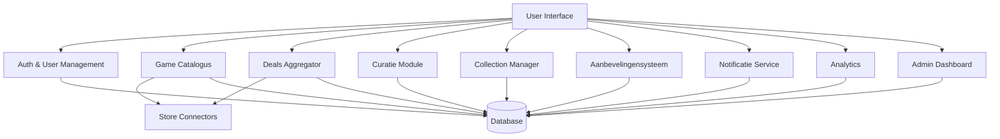

# Logische componenten

We combineren de _actor/action_ en _workflow approach_:

## Actors:

- Bezoeker (Niet ingelogd)
- Ingelogde gebruiker
- Curator
- Winkel API’s (Amazon, Steam, etc.)
- Admin

## Componenten:

- Auth & User Management
- Game Catalogus
- Deals Aggregator
- Store Connectors (scrapers / API clients)
- Curatie Module
- Collection Manager
- Aanbevelingensysteem
- Notificatie Service
- Analytics (Affiliate + Cost Recovery)
- Admin dashboard

## Workflow (voorbeeld):

1. User logt in → personalisatie geladen
2. User bekijkt game → catalogus + deal data samengevoegd
3. User voegt toe aan collectie → aanbevelingen aangepast
4. Notificatie-service monitort prijzen

## Diagram

