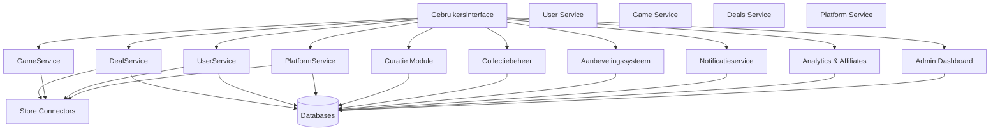
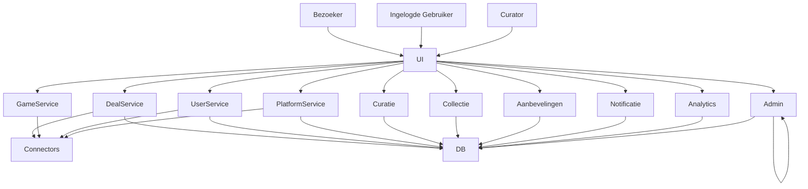

# Logische componenten

We combineren twee manieren om het systeem te begrijpen:

- Actor/actie: wie doet wat?
- Workflow: hoe verlopen de stappen achter de schermen?

## Actoren:

- Bezoeker (Niet ingelogd)
- Gebruiker: ingelogd, met een persoonlijke collectie
- Curator: keurt content goed, voorkomt dubbele of slechte games
- Winkel-API's: zoals Steam, Amazon, PlayStation Store…
- Admin: beheert het platform

## Componenten:

- User Service: regelt login, registratie, profiel en authenticatie
- Game Service: beheert games, beschrijvingen, afbeeldingen en ratings
- Deals Service: verzamelt prijzen uit winkels
- Platform Service: beheert platforms (PC, PS5, Switch...)
- Store Connectors: haalt automatisch data op uit winkels via API's of scraping
- Curatie Module: laat curators content goedkeuren of samenvoegen
- Collectiebeheer: gebruikers beheren hun eigen games
- Aanbevelingssysteem: stelt nieuwe games voor op basis van jouw collectie en ratings
- Notificatieservice: laat de gebruiker weten wanneer een game een promotie heeft
- Analytics & Affiliates: houdt inkomsten en kosten bij, toont hoeveel er is opgehaald
- Admin Dashboard: beheert het systeem

## Workflow (voorbeeld):

1. Inloggen
   -> De gebruiker logt in, gebruikers voorkeuren worden geladen

2. Games bekijken
   -> De gebruiker bezoekt een gamepagina
   -> De app toont info uit de catalogus én de beste deals van het moment

3. Game toevoegen aan collectie
   -> De game wordt toegevoegd
   -> Het aanbevelingssysteem wordt bijgewerkt

4. Prijs volgen
   -> De notificatieservice houdt de prijs in de gaten
   -> De gebruiker ontvangt een melding als de prijs onder zijn/haar drempel komt

5. Games uploaden
   -> De gebruiker voegt zelf een game toe
   -> De curator keurt ze goed

## Diagram

## Diagram met Actoren

