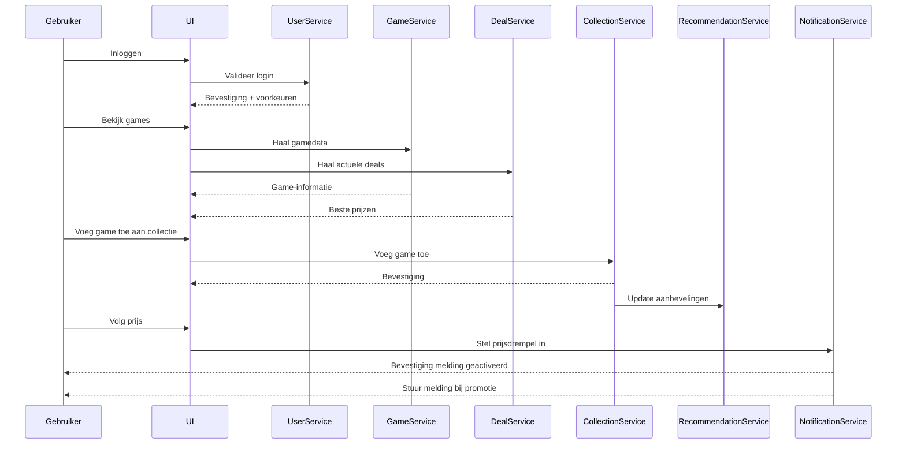
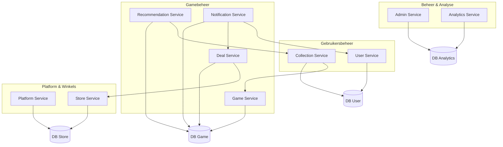

# Logische componenten

We combineren twee manieren om het systeem te begrijpen:

- Actor/actie: wie doet wat?
- Workflow: hoe verlopen de stappen achter de schermen?

## Actoren:

- Bezoeker (Niet ingelogd)
- Gebruiker: ingelogd, met een persoonlijke collectie
- Winkel-API's: zoals Steam, Amazon, PlayStation Store…
- Admin: beheert het platform

## Componenten:

- User Service: regelt login, registratie, profiel en authenticatie
- Game Service: beheert games, beschrijvingen, afbeeldingen en ratings
- Deal Service: verzamelt prijzen uit winkels
- Platform Service: beheert platforms (PC, PS5, Switch...)
- Store Service: haalt automatisch data op uit winkels via API's of scraping
- Collection Service: gebruikers beheren hun eigen games
- Recommendation Service: stelt nieuwe games voor op basis van jouw collectie en ratings
- Notification Service: laat de gebruiker weten wanneer een game een promotie heeft
- Analytics Service: houdt inkomsten en kosten bij, toont hoeveel er is opgehaald
- Admin Service: beheert het systeem

## Organisatie broncode

- De services zijn te zien in de structuur van mijn applicatie.

## Sequence Diagram (Actor/Action approach)

### Dit is de notatie voor een sequence diagram maar het is geen sequence diagram. Het drukt iets anders uit.

## Workflow (voorbeeld):

1. Inloggen
   -> De gebruiker logt in, gebruikers voorkeuren worden geladen

2. Games bekijken
   -> De gebruiker bezoekt een gamepagina
   -> De app toont info uit de catalogus én de beste deals van het moment

3. Game toevoegen aan collectie
   -> De game wordt toegevoegd
   -> Het aanbevelingssysteem wordt bijgewerkt

4. Prijs volgen
   -> De notificatieservice houdt de prijs in de gaten
   -> De gebruiker ontvangt een melding als de prijs onder zijn/haar drempel komt

5. Games uploaden
   -> De gebruiker voegt zelf een game toe

## Mapping logische componenten

## Requirements toewijzen aan componenten

```mermaid
graph TD
  PlatformService["Platform Service"]
  GameService["Game Service"]
  DealService["Deal Service"]
  RecommendationService["Recommendation Service"]
  UserService["User Service"]
  NotificationService["Notification Service"]

  R1["Gebruiker kiest platform"] --> PlatformService
  R2["Ondersteunt fysieke/digitale media"] --> PlatformService
  R3["Toekomstige releases zichtbaar"] --> GameService
  R4["Collectie manueel of automatisch beheren"] --> GameService
  R4 --> PlatformService
  R4 --> DealService
  R7["Gebruikersratings"] --> GameService
  R8["Prijsgeschiedenis bijhouden"] --> DealService
  R9["Prijsnotificaties"] --> NotificationService
  R10["Aanbevelingen op basis van voorkeuren"] --> RecommendationService
  R11["Veerkracht bij storingen"] --> DealService
  R12["Sales in de verf zetten"] --> DealService
```

## Rol en verantwoordelijkheden analyseren

- De Game Service is verantwoordelijk voor gamegegevens en hun verwerking. Cohesie is hoog: alle functies draaien rond games.
- De Deal Service verwerkt en bewaart prijshistoriek en aanbiedingen. Cohesie is hoog: gericht op één doel: deals ophalen, filteren en tonen.
- De Platform Service beheert platformen. Cohesie is hoog: Gaat uitsluitend over het platform-aspect van het systeem.
- De User Service beheert gebruikersgegevens, login/registratie en profielen. Cohesie matig tot hoog: Gaat over gebruikers, maar kan in de toekomst meer gesplitst worden (bijv. aparte auth service).

## Architecturale karakteristieken analyseren (gebaseerd op de driving characteristics)

### Live bijwerken van gegevens (Performance)

- Deal Service maakt snelle updates en caching mogelijk voor prijsinfo.
- Game Service toont nieuwe releases direct.

### Blijft werken bij externe storingen (Resilience)

- Deal Service bevat retries, fallbacks en circuit breakers.

### Personalisatie & Aanbevelingen (UX / Intelligence)

- Recommendation Service verwerkt voorkeuren, ratings en gedrag.
- User Service bewaart gebruikersinstellingen

## Afferente vs. Efferente koppeling per component

### Component, Afferente Koppeling, Efferente Koppeling, Uitleg

- Game Service: Hoog, Gemiddeld, Wordt door veel services gebruikt (frontend, aanbevelingen), haalt data van deals op
- Deal Service: Hoog, Hoog, Veel componenten raadplegen deals, en het hangt af van externe APIs
- User Service: Hoog, Laag, Gebruikt vooral zijn eigen database, maar wordt vaak geraadpleegd (auth, voorkeuren)
- Platform Service: Gemiddeld, Laag, Levert data aan andere services, maar is zelf weinig afhankelijk
